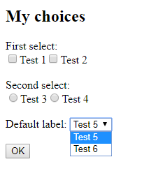

MchChoiceListTypeBundle Documentation
=====================================

## 1. Installation

```bash
$ composer require mch/choicelist-type-bundle
```

## 2. Configuration (without Flex)

If you're not using Flex, enable the bundle in the kernel:

```php
// app/AppKernel.php

public function registerBundles()
{
    $bundles = [
        // ...
        new Mch\ChoiceListTypeBundle\MchChoiceListTypeBundle(),
        // ...
    ];
}
```

## 3. Basic Usage

Usage is mainly similar to a traditionnal [CollectionType field](https://symfony.com/doc/current/reference/forms/types/collection.html),
specifically used with a [ChoiceType field](https://symfony.com/doc/current/reference/forms/types/choice.html) collection.

The ChoiceListType simply adds a new "choices_config" option in the "entry_options" option.
This option allows to specify different dataset for each field in the collection:

```php
use Mch\ChoiceListTypeBundle\Form\Type\ChoiceListType;
// ...

// fields configuration (lists of choices)
$choicesConfig = [
    ['Test 1' => 'test1', 'Test 2' => 'test2'],
    ['Test 3' => 'test3', 'Test 4' => 'test4'],
];
// form builder
$builder->add('choices_list', ChoiceListType::class, [
    'entry_options' => [
        'choices_config' => $choicesConfig,
    ],
]);
```

Other options (ex. "required", "expanded" or "multiple") are still availabled and could be added to the "entry_options":

```php
use Mch\ChoiceListTypeBundle\Form\Type\ChoiceListType;
// ...

// fields configuration (lists of choices)
$choicesConfig = [
    ['Test 1' => 'test1', 'Test 2' => 'test2'],
    ['Test 3' => 'test3', 'Test 4' => 'test4'],
];
// form builder
$builder->add('choices_list', ChoiceListType::class, [
    'entry_options' => [
        'choices_config' => $choicesConfig,
        'multiple' => true,
        'expanded' => true,
        'required' => true,
    ],
]);
```

## 4. Form Rendering and Default Data Values

Form rendering in twig is similar to a classic [CollectionType rendering](https://symfony.com/doc/current/reference/forms/types/collection.html#basic-usage).
Notice that a collection field only render if associated form data already exists.

In the case of a ChoiceListType, each field must have a default value for a correct rendering.
For example, to initialize and render the previous example with default value:

If select multiple option is not enabled:

```php
// ...

// first field default value is empty,
// second field default value is 'test3'
$data = [
    'choices_list' => ['', 'test3'];
];

$builder = $this->createFormBuilder($data);

//...
```

If select multiple option is enabled:

```php
// ...

// first field default values are 'test1' and 'test2'
// second field default value is empty
$data = [
    'choices_list' => [['test1', 'test2'], []];
];

$builder = $this->createFormBuilder($data);

//...
```

## 5. Complete Example: Fav Books

Consider a class "Book", which represents a simple book with an Id and a title:

```php
class Book
{
    // id
    private $id;
    
    // title
    private $title;

    // simple constructor
    public function __construct(int $id, string $title)
    {
        $this->id = $id;
        $this->title = $title;
    }

    // ...
    // here are the getters and setters
    // ...
}
```

Consider then a class "Booklist" that provides multiple lists of books:

```php
class Booklist
{
    public static function getBooks(): array
    {
        return [
            // Stephen King
            [
                new Book(1, 'Shining'),
                new Book(2, 'Carrie'),
                new Book(3, 'Misery'),
            ],
            // J.R.R. Tolkien
            [
                new Book(4, 'The Hobbit'),
                new Book(5, 'The Lord of the Rings'),
            ],
            // Philip K. Dick
            [
                new Book(6, 'The Man in the High Castle'),
                new Book(7, 'Do Androids Dream of Electric Sheep?'),
                new Book(8, 'Ubik'),
            ],
        ];
    }
}
```

Imagine that you want to create a list of your favorite books. You could create the following "Favbooks" class:

```php
class Favbooks
{
    // collection of favorite bookes
    private $books;

    // constructor: init books
    public function __construct()
    {
        $this->books = [];
    }

    // add a book to fav list
    public function addBook(?Book $book): Favbooks
    {
        $this->books[] = $book;
        return $this;
    }
    
    // ...
    // here are the getters and setters
    // ...
}
```

The aim of this example is to permit the selection of one favorite book from each list.
Let's see how the form could be created with the "ChoiceListType".

First, we get the list of books and intialize the favbooks list:

```php
// get the lists of books
$booklist = Booklist::getBooks();

// init the favbooks list with empty data
$favbooks = new Favbooks();

// we don't pre-supppose how many books lists exist
for ($i = 0, $nb = count($booklist); $i < $nb; $i++) {
    $favbooks->addBook(null);
}
```

Then, just create the form using Favbooks and Books instances:

```php
// create the form
// data is a Favbooks instance
$form = $this->createFormBuilder($favbooks)
    ->add('books', ChoiceListType::class, [
        'entry_options' => [
            'choices_config' => $booklist,
            'required' => false,
            'expanded' => false,
            'multiple' => false,
            // set book's name as choice label
            'choice_label' => function (Book $book, $key, $value) {
                return $book->getTitle();
            },
            // set book's id as choice value
            'choice_value' => function (Book $book = null) {
                return $book ? $book->getId() : '';
            },
        ],
    ])
    ->getForm();
 
// handle request    
$form->handleRequest($request);

if ($form->isSubmitted() && $form->isValid()) {
    $favbooks = $form->getData();

    // ...
    // do some cool stuff
    // ...
}

// display form
```

It will result in a field displaying each books list as an independant select element:


## 6. Advanced Usage: Fields Configuration

### 6.1 Description and Example

What if I need that each field has a independant configuration? The ChoiceListType comes with an other option
called "fields_config".

Its usage is the same as "choices_config" and it permits to add different configuration for each field. For example:

```php
use Mch\ChoiceListTypeBundle\Form\Type\ChoiceListType;
// ...

// choices configuration
$choicesConfig = [
    ['Test 1' => 'test1', 'Test 2' => 'test2'],
    ['Test 3' => 'test3', 'Test 4' => 'test4'],
    ['Test 5' => 'test5', 'Test 6' => 'test6'],
];

// fields configuration
$fieldsConfig = [
    ['label' => 'First select', 'multiple' => true, 'expanded' => true,],
    ['label' => 'Second select', 'expanded' => true,],
    null,
];

// form builder
$builder->add('choices', ChoiceListType::class, [
    'label' => 'My choices',
    'entry_options' => [
        'choices_config' => $choicesConfig,
        'fields_config' => $fieldsConfig,
        'label' => 'Default label',
    ],
]);
```

It will result in:



### 6.2 Allowed values

The "fields_config" option accept the following entries:
* label,
* expanded,
* multiple,
* required,
* placeholder,
* preferred_choices,
* group_by.

All other entries will be ignored.

### 6.3 Default values

The "fields_config" option is totally optional and could be omitted. In this case, all the fields will have the same 
configuration.

As well, all entries in this option are not required and you can ommit some of them in the options list.
In this case, the option will apply only for the filled fields.

Finally, you can mix "fields_config" options and "entry_options" options. The options will be applied in this order:
1. Option in "fields_config": applied for the concerned field,
2. Option in "entry_options': applied for all field that do not have a specific "fields_config" option,
3. Default "ChoiceType" option: applied by default if no option is set.
